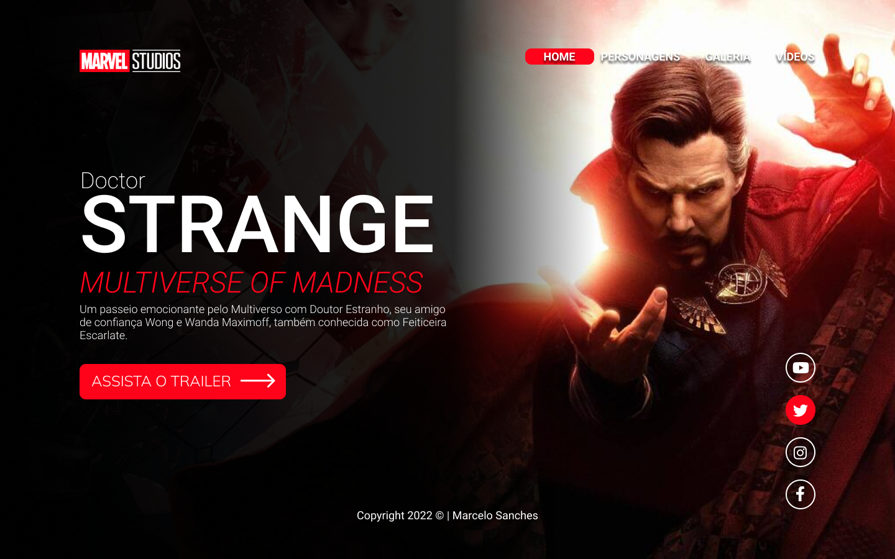
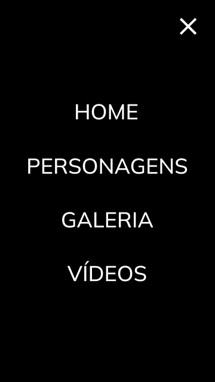

# Doctor Strange
Projeto construído durante as aulas de LIMA, no curso de Desenvolvimento de Sistemas do [SENAI Jandira](https://jandira.sp.senai.br/), com orientação do Prof. [Fernando Leonid](https://github.com/fernandoleonid)

 

---

## Qual era o objetivo do projeto?
O objetivo era criar uma landing page com base no desing feito no figma, aprendendo a estrutura do HTML, CSS, JS e conceitos de responsividade.

---

## O que é uma Landing Page?
As landing Pages são páginas com foco principal na conversão de visitantes, assim, essa páginas possuem uma estética mais minimalista comparada com os sites tradicionais.

---

## Tecnologias usadas
- HTML 5
- CSS 3
- Javascript
- Figma

--- 

## Links
- Veja o [Resultado](https://xanxes.github.io/DoctorStrange/) final do projeto.
- Confira o conceito no [Figma](https://www.figma.com/file/ckHxugk7tBRArLNYAvTnDH/DOCTOR-STRANGE?node-id=14%3A71).
- Meu [código](https://github.com/xanxes/DoctorStrange).

---

## Autor
[Marcelo Sanches](https://github.com/xanxes)
